# Model Documentation

This document provides details about the machine learning models used in the CROPIX backend.

## 1. Disease Detection Model (CNN)
- **File:** `CNN/Disease_Detection_model[CNN].h5`
- **Purpose:** Detects plant diseases from images.
- **Type:** Convolutional Neural Network (CNN)
- **Training Methodology:** (To be filled: Describe the CNN architecture, layers, activation functions, optimizer, loss function, and training epochs.)
- **Dataset:** [PlantVillage Dataset (Kaggle)](https://www.kaggle.com/datasets/emmarex/plantdisease), [Rice Leaf Diseases Dataset (Kaggle)](https://www.kaggle.com/datasets/vbookshelf/rice-leaf-diseases), [Wheat Disease Detection (Kaggle)](https://www.kaggle.com/datasets/sinadunk23/behzad-safari-jalal)
- **Performance Metrics:** 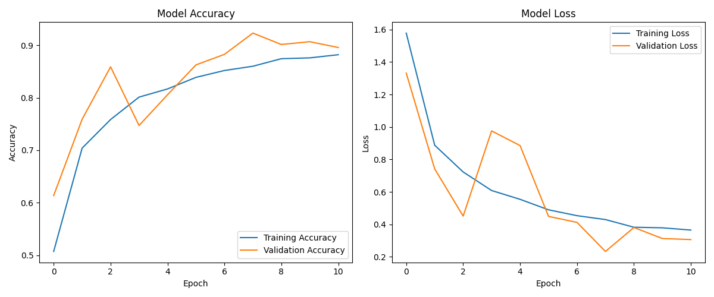

## 2. Crop Yield Model
- **File:** `CROP_YIELD_MODEL.joblib`
- **Purpose:** Predicts crop yield based on various input features.
- **Dataset Source:** [Crop Yield in Indian States Dataset (Kaggle)](https://www.kaggle.com/datasets/akshatgupta7/crop-yield-in-indian-states-dataset)
- **Type:** Regression Model
- **Training Methodology:** (To be filled: Describe the model used, feature engineering, and training process.)
- **Dataset:** (To be filled: Describe the dataset used for training, including features like soil type, weather, and historical yield data.)
- **Performance Metrics:** 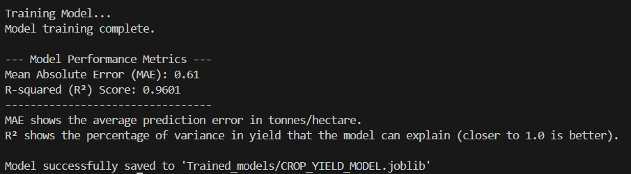, 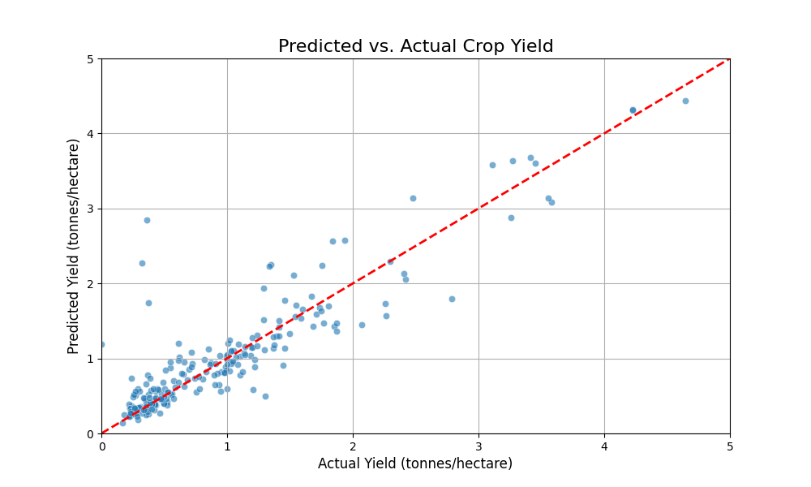

## 3. Soil-Crop Recommendation Model
- **File:** `Soil_crop_recom.joblib`
- **Purpose:** Recommends suitable crops based on soil characteristics.
- **Dataset Source:** [Crop Recommendation Dataset (Kaggle)](https://www.kaggle.com/datasets/atharvaingle/crop-recommendation-dataset)
- **Type:** K-Nearest Neighbors (KNN)
- **Training Methodology:** (To be filled: Describe the model used, input features (e.g., N, P, K, pH), and training process.)
- **Dataset:** (To be filled: Describe the dataset used for training, including soil nutrient data and corresponding suitable crops.)
- **Performance Metrics:** 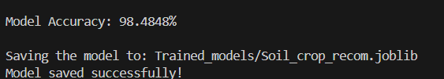, 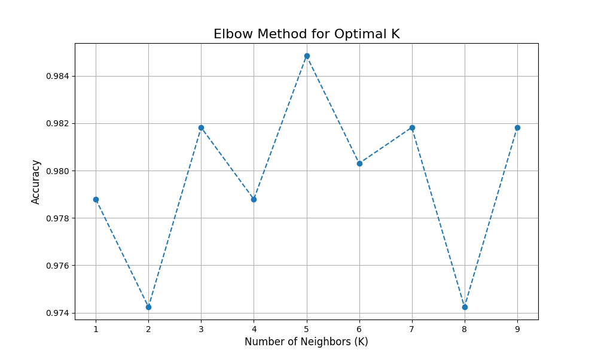

## 4. Fertilizer Recommendation Model
- **File:** `fertilizer_recommendation_model.joblib`
- **Purpose:** Recommends the optimal fertilizer type based on soil and crop conditions.
- **Type:** Classification Model
- **Training Methodology:** (To be filled: Describe the model used, input features (e.g., N, P, K, crop type, soil type), and training process.)
- **Dataset:** (To be filled: Describe the dataset used for training, including soil and crop data with corresponding fertilizer recommendations.)
- **Performance Metrics:** 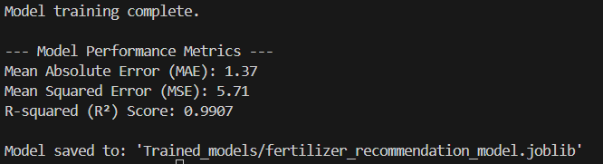, 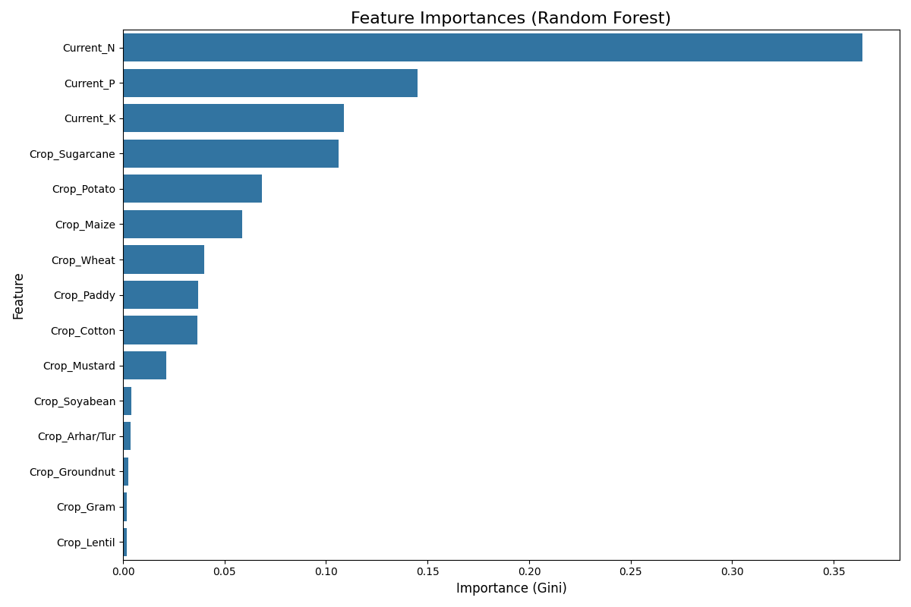, , 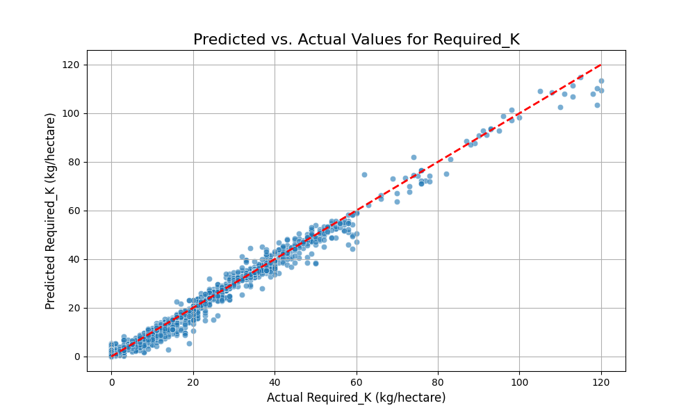, 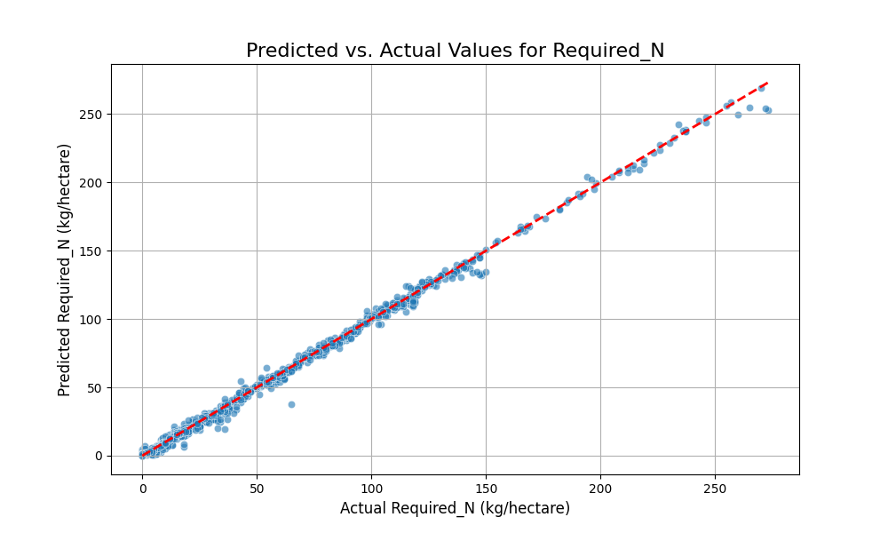, 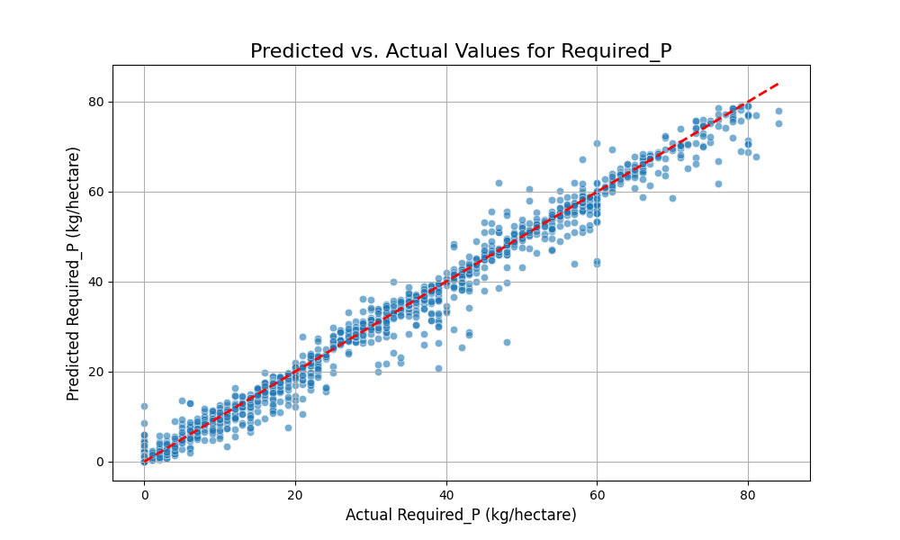

## 5. Market Price Forecast Model
- **File:** `lstm_model.keras`
- **Purpose:** Forecasts future market prices for agricultural products.
- **Dataset Source:** [Agmarknet.gov.in](https://agmarknet.gov.in/PriceAndArrivals/CommodityDailyStateWise.aspx)
- **Market Prices Data:** [Agmarknet.gov.in](https://agmarknet.gov.in)
- **Type:** Long Short-Term Memory (LSTM) Neural Network
- **Training Methodology:** (To be filled: Describe the LSTM architecture, time-series data preprocessing, sequence length, and training parameters.)
- **Dataset:** (To be filled: Describe the time-series dataset used for training, including historical price data.)
- **Performance Metrics:** 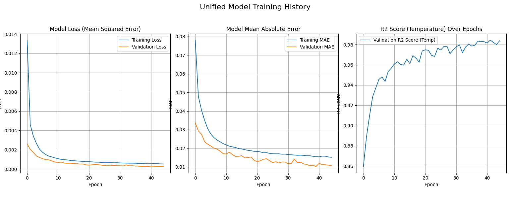
## 6. Weather Forecast (API Integration)
- **Purpose:** Provides weather forecasts for a given city and number of days.
- **Type:** API Integration (weatherapi.com)
- **Implementation Details:** Fetches weather data directly from weatherapi.com using an API key.
- **Endpoint:** `/weather_forecast/` and `/weather_forecast_lstm/` (both currently use direct API calls)
- **Input:** City name and number of days for the forecast.
- **Output:** Daily forecast summary including min/max/avg temperature, humidity, chance of rain, and condition.
